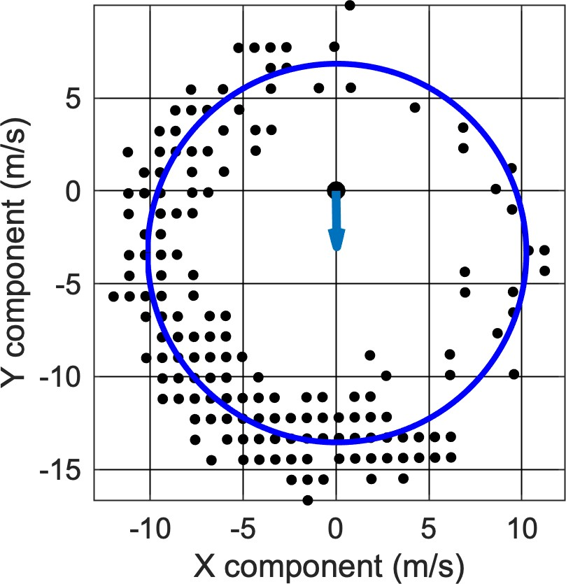

```{r include = FALSE}
knitr::opts_chunk$set(echo=FALSE)
```

This document will examine the results of the [Yonehara wind estimation method](https://www.pnas.org/doi/10.1073/pnas.1523853113) (YWE) when using differently sampled data, as well as differently sized windows.

The YWE originally used GPS data sampled at 1Hz. This is a very high frequency sampling rate and doesn't typically occur in most studies. Therefore, we want to test the effectiveness of this method across other sampling rates. The method itself uses a 5-minute moving window to estimate wind speed and direction. The bird's speed and direction are converted to X and Y components of the bird's velocity to form parts of a circle, where theoretically the center of that circle should move from the origin dependent on the external wind vector acting on the bird.

<figure align="center">
    
    <figcaption align ="center">Fig. 1 - Example of YWE fit to data (black dots) with estimated circle (blue) and estimated wind vector (blue arrow)
    </figcaption>
</figure>

A circle is fit to the data using least squares and the resultant deviation from the origin is calculated. In the original method, a 5-minute moving window with data gathered at 1Hz frequency produces $n = 300$, where $n =$ data points per window. Changing the sampling frequency will reduce $n$, and therefore reduce the model fit accuracy. We want to test the effect of subsampling and see if there is a clear cutoff point at which the wind estimates become significantly different in their output.

To do so, data collected at 1Hz frequency is used. Streaked shearwaters were tagged in 2016 with AxyTrek Marine tags recording GPS at 1Hz. The YWE is applied to this data in it's original format to produce a baseline for comparison. The data are then subsampled to reflect GPS sampling once every 5, 10, 30 and 60 seconds. Maintaining the same window size reduces $n$ as follows:

| Sampling rate | $n$ per 5 minute window |
| ------------- | ------------------------------- |
| 1 fix per second | 300 |
| 1 fix per 5 seconds | 60 |
| 1 fix per 10 seconds | 30 |
| 1 fix per 15 seconds | 20 |
| 1 fix per 30 seconds | 6 |

An alternative is to adapt the time window to maintain $n$ across all sampling frequencies. This produces the following time windows:

| Sampling rate | Time window (mins) |
| ------------- | ------------------------------- |
| 1 fix per second | 5 |
| 1 fix per 5 seconds | 25 |
| 1 fix per 10 seconds | 50 |
| 1 fix per 15 seconds | 75 |
| 1 fix per 30 seconds | 150 |

Clearly this reduces the temporal frequency of the YWE, and similarly comparing results may not be as viable as instead of comparing results from the same period of wind exposure, we would be comparing the results of winds experienced over 5 minutes to winds experienced over 25 - 150 minutes.

## Comparison over fixed time windows

```{r include=FALSE}
if(Sys.info()['sysname'] == "Darwin"){
    fileloc <- "/Volumes/GoogleDrive/My Drive/PD/BiP/YoneMethodComparison/"
} else {
    fileloc <- 'I:/My Drive/PD/BiP/YoneMethodComparison/'
}
files = dir(fileloc, full.names=T)
compDat <- vector(mode="list",length=length(files))
for(b in 1:length(files)){
  compDat[[b]] <- read.delim(files[b],header=T,sep=",")
  compDat[[b]]$Time <- as.POSIXct(compDat[[b]]$Time,format="%d-%b-%Y %H:%M:%S",tz="")
  compDat[[b]]$Tag <- regmatches(files[b], regexec("Comparison/(.*)Comparison.*", files[b]))[[1]][2]
}
```

The midpoint time was calculated for each estimation. Therefore, we will compare wind direction and speed, and air direction for each subsampled value calculated at the same timepoint $\pm$ the sampling rate.

```{r include=FALSE}
compDF = as.data.frame(b[b$treatment == "5min" & b$fs == 5,
                         c("Time","wSpeed","wDir","aSpeed","fs","Tag")])
CompTimes <- compDF$Time
sampFreqs <- c(1,10,30,60)
for(d in 1:length(sampFreqs)){
  for(c in CompTimes){
    if(any((b$Time > (c - 30)) & (b$Time < (c + 30)) & b$treatment=="5min" & b$fs==sampFreqs[d])){
      compDF <- rbind(compDF,b[which((b$Time > (c - 30)) & (b$Time < (c + 30)) & b$treatment=="5min" & b$fs==sampFreqs[d]),c("Time","wSpeed","wDir","aSpeed","fs","Tag")])
    }
  }
}
compDF$fs <- as.factor(compDF$fs)
library(ggplot2)
ggplot(compDF) + geom_point(aes(x = Time, y = wDir, colour = fs))
sort(compDF$Time)

```
